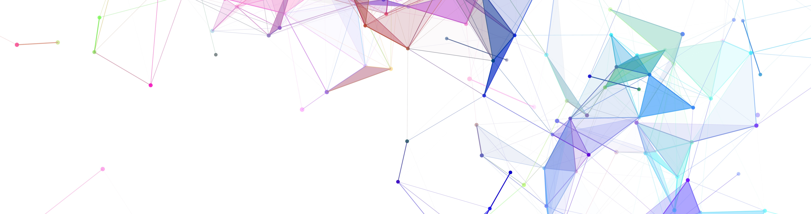

<!-- Google tag (gtag.js) -->

  

  
<h4 class="subheading" align="left">From incubators, accelerators, and technical consulting to community-driven research projects, CLASS drives innovation through collaboration.</h4>

 
 
 

 <table style="width:100%">
  <tr>
    <td><i class="fas fa-laptop-code" style="font-size:72px;color:#007474;"></i></td>
    <td><i class="fas fa-hand-holding-droplet" style="font-size:72px;color:#007474;"></i></td>
    <td><i class="fas fa-users-cog" style="font-size:72px;color:#007474;"></i></td>
  </tr>
  <tr>
    <td><h4 class="subheading text-muted">Tech Lab</h4></td>
    <td><h4 class="subheading text-muted">Incubators</h4></td>
    <td><h4 class="subheading text-muted">Community Projects</h4></td>
  </tr>
  <tr>
    <td>CLASS offers technical consultation to help move your research projects forward. Our team of Cloud, and Research Computing, Data, and Software SMEs can assist in developing architecture, brainstorm efficient coding solutions, help find the right cyberinfrastructure workflows, and pave the way for understanding large datasets. <a href="mailto:class@internet2.edu">Reach out to us today</a> to see how CLASS can help resolve your challenges. </td>
    <td>Our partnerships produce meaningful and successful outcomes. <a href="https://internet2.edu/internet2-microsoft-azure-accelerator-2022-researchers-in-action/">Learn more about our recent collaboration with Microsoft Azure on the CLASS Accelerator for AI and Machine Learning</a>. </td>
    <td>CLASS supports open collaboration and knowledge sharing. We invite you to contribute and utilize content and tools from our learning programs on <a href="https://github.com/search?q=org%3AInternet2+%2Fclass&type=repositories">Github</a>.
</td>
</tr>
</table> 

