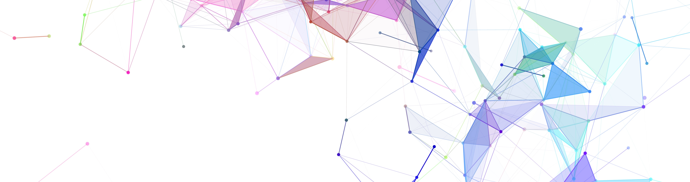

  

  
<h4 class="subheading" align="left">CLASS builds on Internet2’s network of experts and members to build an inclusive and collaborative community.</h4>

 
 

<h3 class="section-subheading text-uppercase text-muted">CLASS WEBINAR SERIES AND PRESENTATIONS</h3>

 
 

The CLASS Continuing Learner Engagement is a series of webinars and experiences presented by leading Campus and Research IT professionals. The webinar series often consists of talks on cutting-edge technologies, challenges, and solutions related to cloud computing, data science, big data, and AI/ML. 
 
 
<table style="width:100%">
<tbody>
            <tr>
                <td><strong>Date</strong></td>
                <td><strong>Title</strong></td>
                <td><strong>Presenter</strong></td>
                <td><strong>Video</strong></td>
                <td><strong>Materials</strong></td>
            </tr>
            <tr>
                <td>May 10, 2024</td>
                <td>CLASS Advanced Spring 2024 Final Presentation</td>
                <td>Various</td>
                <td><a target="_blank" rel="noopener noreferrer" href="https://internet2.zoom.us/rec/share/bmW4W0hKtoCCTOpl9XHWDazejeKHcGzmGwYYlrp5YG04af5BIf3wt8n5G3Eu2_ue.z2P0Z3C9HkHVQHYB">Recording</a></td>
                <td>Slides</td>
            </tr>
            <tr>
                <td>May 9, 2024</td>
                <td>Introduction to Jetstream</td>
                <td>Jennifer Taylor</td>
                <td><a target="_blank" rel="noopener noreferrer" href="https://internet2.zoom.us/rec/share/NM7AEudfzi5ude3Pl5bZspSAA9ROX5ZtCYsHzd8Al-sFO-TBEcm_UgrzhW75lTjX.zPV-cqd8YXqa30EJ">Recording</a></td>
                <td><a target="_blank" rel="noopener noreferrer" href="https://docs.google.com/presentation/d/1kCDEaz3t9diHmOcakGyvrRQQQ-gLvhiJGF1sV5POc70/edit#slide=id.g28a0a093998_0_1">Slides</a></td>
            </tr>
            <tr>
                <td>May 8, 2024</td>
                <td>Orchestrating a Successful AI Initiative on Campus</td>
                <td>Brandon Rich</td>
                <td><a target="_blank" rel="noopener noreferrer" href="https://internet2.zoom.us/rec/share/VetpDItbZ6hdNLY5aG6KlSm977sC_hbT3sNWJ6vogWIJsrw6yWNmLUD28Uhx-W4.3dggKxz-3CZvPgnv">Recording</a></td>
                <td><a target="_blank" rel="noopener noreferrer" href="https://docs.google.com/presentation/d/1myeCWslZuYvbUUs1N1c71QmqSVlUku_HWJCo61S0M0w/edit#slide=id.g2d9c5889bf7_0_25109">Slides</a></td>
            </tr>
            <tr>
                <td>May 7, 2024</td>
                <td>A Practical Guide to AWS Security on the Cloud</td>
                <td>James Smith</td>
                <td><a target="_blank" rel="noopener noreferrer" href="https://internet2.zoom.us/rec/share/F9tQpFIgahktR630OdN7KJw67fWI4csnc5Gvsi9BnDmnImGioCMKgT_PL7Vu9844.euUUUgAfnK1UGlbH">Recording</a>&nbsp;</td>
                <td><a target="_blank" rel="noopener noreferrer" href="https://docs.google.com/presentation/d/1DgCJ503E8P1ooBP9ju_M-d_RxYCQSSsca4tLeNdUIrQ/edit?usp=sharing">Slides</a></td>
            </tr>
            <tr>
                <td>May 6, 2024</td>
                <td>Project Eureka and Adaptive Computing at Scale</td>
                <td>Boyd Wilson</td>
                <td><a target="_blank" rel="noopener noreferrer" href="https://internet2.zoom.us/rec/share/US0y9oePYwLu2Ae_i4J7mZMobgCRbLgFq9H0hPwPxTZwb012tFfqiXbQLcg9vB70.V0fPqmX8fBE5Cx88">Recording</a></td>
                <td><a target="_blank" rel="noopener noreferrer" href="https://docs.google.com/presentation/d/1RKCaAMtLSlZoq6sfBpQU5Is8DpOME_mr/edit?usp=sharing&amp;ouid=108337990353618794576&amp;rtpof=true&amp;sd=true">Slides</a></td>
            </tr>
        </tbody>    

</table>
 
 
 

If you have questions, please contact us by email at <a href="mailto:{{ site.email }}">{{ site.email }}</a>.
 
 
 

